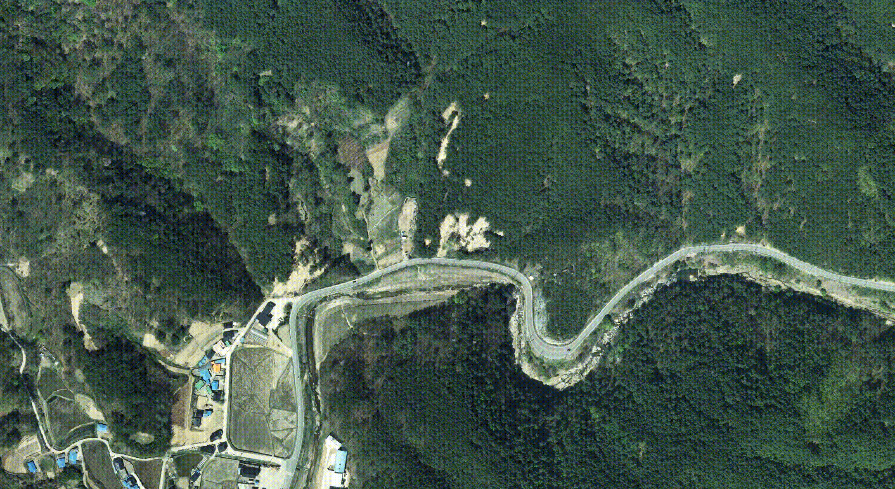

# Orthophoto_Maps
A mapping software that generate individual maps(orthophotos) from drone images.
Only with images(and sensory data), you can generate orthophotos of area of interests.



Steps:
1. Georeferencing: determine **<u>camera pose(position: x, y, z; orientation: $\omega$, $\phi$, $\kappa$)</u>** and **<u>3D coordinates(x, y, z)</u>**
2. DEM processing
  -  Option 1: Average height plane
  -  Option 2: (Generated sparse point clouds, will be added soon)
3. Geodata generation
  1. Rectify
  2. Pixel resampling

## Installation
I tested it in python 3.8, Ubuntu 18.04
```
conda env create -f environment.yaml
conda activate orthophoto
```

## Usage
After installation and set the input path, you can immediately run for direct georeferencing:
```
python main_dg.py
```
It generates individual orthophotos for each photo
For now, you have to edit configurations like input path, output path and sensor width in main_dg.py
They have to be defined in config file

Other codes are in arrangement
For example, code for local bundle adjustment and thermal image processing will be added soon

### Input & Output
| Contents | Data | etc. |
|:----------|:----------|:----------|
| Input | Drone images | DJI(now) |
| Output | Individual orthophoto | GeoTIFF |

## Future Work
- [ ] Ref. bundle adjustment
- [ ] Ray-tracing
- [ ] Time table saving
- [ ] Configurations
	- [ ] Input path
	- [ ] Output path
	- [ ] System calibration
	- [ ] Ground height
	- [ ] GSD